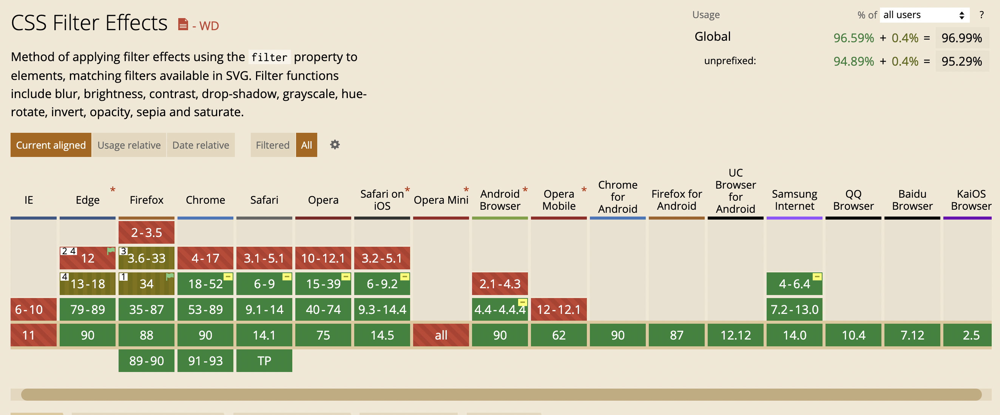

# 一行代码进入悼念模式

一行代码进入全站悼念模式，把 `<html>` 替换成 `<html style="filter:grayscale(1)">` 即可。

核心代码是 `filter:grayscale(1)`，意思是「把当前元素及其后代元素设置成 100%的灰度模式」。

如果需要兼容低版本浏览器:

```tsx | pure
<html class="gray">

.gray {  
    -webkit-filter: grayscale(1); /* Old Chrome、Old Safari、Old Opera*/  
    filter: grayscale(1); /* 现代浏览器标准 */  
    filter: progid:DXImageTransform.Microsoft.BasicImage(grayscale=1); /* IE */
}

```

## 兼容性



对于低版本浏览器或某些弱智浏览器，可能不支持 CSS Filter。为大家推荐使用 [grayscale.js](https://github.com/johndigital/grayscale-js)，一个多种兼容模式的灰度模式 JS 库。

其原理也很简单，对当前元素及其后代元素的样式进行分析，提取 border-color、background-color 和 color 并设置成灰色，提取``和 background-image 的图像并使用 canvas 绘制对应的灰度图像再替换原图像。

由于使用 canvas 绘制会存在对全站图片的渲染损耗，造成不必要的卡顿，因此多图网站慎用。

## 注意

如果是设置了`<body>`或某个主要元素的 filter，会发现 absolute/fixed 定位的元素会出现异常，导致某些布局会发现排版错乱。这是因为元素设置了 filter 不为 none 时，若自身及其后代元素存在 absolute/fixed 定位，则为其创建一个新容器，使得这些 absolute/fixed 定位的元素其定位基准相对于这个新容器进行。

so 要实现全局灰置的效果，最好设置在`<html>`标签上，因为不管怎样设置定位基准，`<html>`都是最顶层的容器，即使创建了新的定位基准元素，也不会对自身及其后代元素产生不符合预期的影响。

## 相关推荐

[CSSgram](https://una.im/CSSgram/) 通过 CSS Filter 和 CSS Blen Mode 还原 Instagram 风格的图片滤镜。
